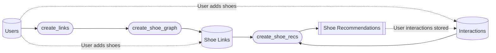

# shoe-db
Toy backend for shoe recommendation

## Data/Code Diagram  

```mermaid
flowchart LR
db1[(Users)] --> py1([create_links])
py1 --> py2([create_shoe_graph])
py2 --> db2[(Shoe Links)]
db2 --> py3([create_shoe_recs])
py3 --> json1[[Shoe Recommendations]]


db1 -. User adds shoes .-> db2
db1 -. User adds shoes .-> db3[(Interactions)]
json1 -. User interactions stored .-> db3
db3 --> py3
```